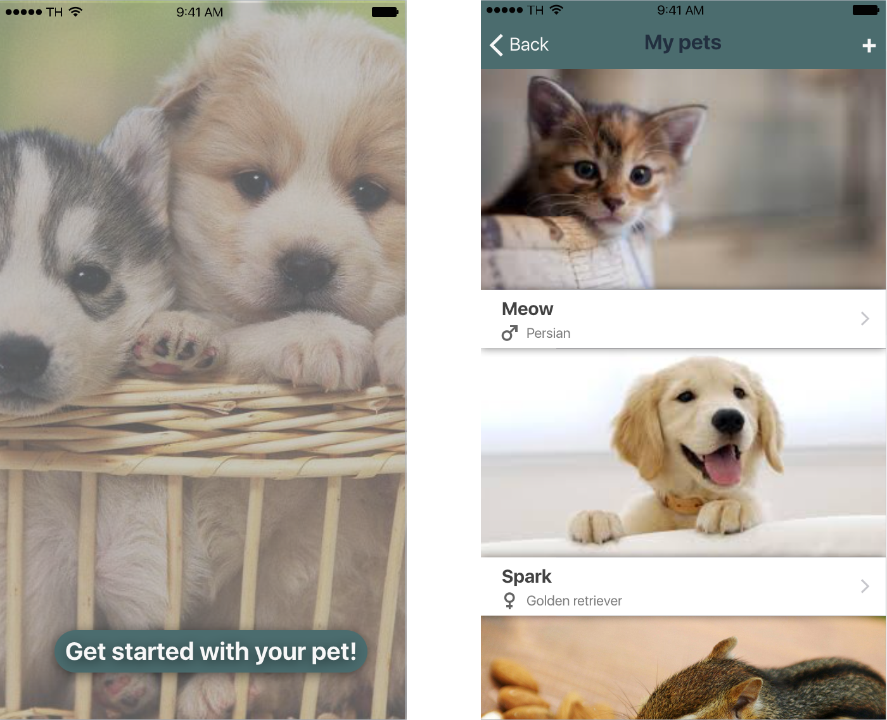

# Petcare

> This app will revolutionize the way you treat your lovely pet!

### Info

This application is being developed at
[BEPiD](https://github.com/bepid-ifce), a brazilian program for iOS development, hosted by [IFCE](http://ifce.edu.br) 

### Idea 

At the beginning of our development process, we've made a lot of research to
look for areas and contexts where an useful, aimed at the general public, mobile application could rise and we've reached pets.

Ok, not everyone has a pet, but a lot of people do (and i hope i can convince
you to adopt one if you don't :smile: ) and we found out most of these people dont't
have routines scheduled for the animal, like bath frequency, food, water and
even deworming. "Why?", you ask me. We think it's about convenience,
procrastination and discomfort. 

Our idea is, for the sake of the little animals, to make it easier for the user
(a pet owner) to manage these schedules and routines, according to the animal,
it's breed, it's health condition, it's medical recomendations, and it's
behavior.

It still gives you a stimulating gaming environment, achievement-based, so
beyond the pleasure of taking care of your buddy, you can achieve awards and
prizes to show your friends, gain badges and have fun!

And beyond all, it still provides a social ambience where you can guard and share pictures of your pet and show everyone how cute is your pet!

### Motivation

All of this is about the well-being of your little friend! We don't know
him but we love him, and i'm sure you too.

### Stage

`In development`

### Who to blame

[Felipe Borges](https://github.com/feliborgez), [Raul
Marques](https://github.com/raulmo1337) and [Gustavo
Gomes](https://github.com/gustavogomesdeoliveira), the sunglasses team!
:sunglasses:  :sunglasses:  :sunglasses:

### License

[GPL-3.0](https://opensource.org/licenses/GPL-3.0) © [GNU](https://www.gnu.org)

    

